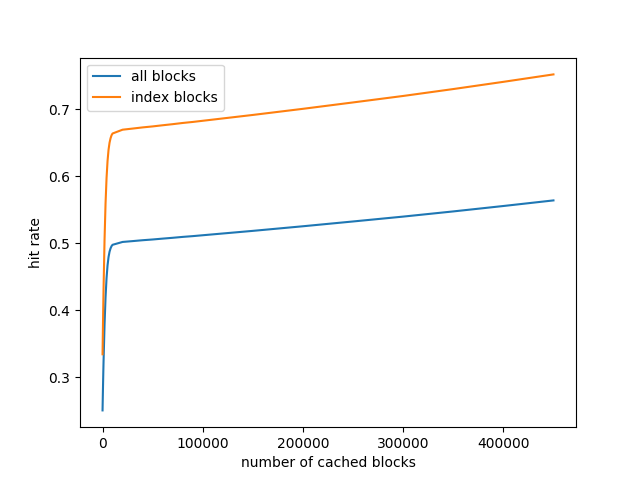

# PingCAP小作业

## 题目要求

某个机器的配置为：CPU 8 cores, MEM 4G, HDD 4T

这个机器上有一个 1T 的无序数据文件，格式为 (key_size, key, value_size, value)

请设计一个索引结构，使得并发随机地读取每一个 key-value 的代价最小

允许对数据文件做任意预处理，但是预处理的时间计入到整个读取过程的代价里

## 整体思路

- 索引结构为基于全局有序的树状结构。

- 通过加入内存缓存层，减少IO操作以及控制资源使用量。

## 索引结构

- 将全局有序的`(key,value)`数据分割成8K大小的数据块，每个块按序标号并存成文件，作为树的叶子节点。

- 树的中间节点为8K大小的索引块，内部是有序的`(key,块号)`，用于索引子层中的多个块。

- 当一个索引块不足以索引所有的下层节点时，该层将扩展出多个索引块来索引下一层的块，同时该层也会被更上一层索引，直至最后被唯一的根节点索引。

## 缓存结构

- 为尽可能地减少IO读操作，在内存中保留最常访问的多个块。

- 规定只能通过缓存层访问数据。通过设置缓存块数目，可以控制应用的资源使用量，避免内存不足。

- 当缓存未命中而缓存层满载时，用LRU算法换走旧块，从文件系统中读取新块。

- 文件是已排序的，读取时只需复制到数组中，随后的查找过程采用二分法。

## 查找过程

给定key，查找value的过程如下：

- 从获取根节点索引块开始，通过二分查找其内存索引数组，找到key对应的下层块。

- 用同样的key，继续查找下层块，直至叶子节点。

- 从叶子节点中的数据块中找到value，返回。

## 实现

### 索引结构的构建

1. 排序阶段

   1.1 采用多路归并的方式进行排序。将1T大小的源数据拆分成1K个1G大小的数据段，分别在内存中排序、输出到文件。随后打开这1K个段文件。

   1.2 不断地从1K个段中取最小的key-value，填入8K的数据缓冲区中，直至填满。

   1.3 当8K数据缓冲区被填满后，输出成数据块文件，并将其交付给索引构建阶段。随后返回1.2继续循环执行，直至所有key-value读取完成。

2. 索引构建阶段

   2.1 取被交付块的最大key作为index key，往当前层最新索引块添加一条`(index key,块号)`记录。

   2.2 若当前层最新索引块被填满，则输出成索引块文件，并继续往更上一层提交被填满的索引块，与2.1步形成递归。

### 缓存层

- 若某个块被访问，该块会被Pin住，被Pin住的块不会被LRU算法换出。

- 保证并发访问下的安全：

  - 将获取块的方法设为同步方法。
  
  - 每一个块由读写锁保护，写锁用在复制文件的过程，读锁用在访问内部数组的过程。
  
- 若某个被请求的块不在缓存层而缓存层已经满了，则用LRU替换器替换出一个旧块，读取请求块对应的文件，改写旧块的内容。

## 资源情况

### 排序阶段

#### 硬盘空间

由 1T（源文件）+ 1G（段文件）× 1K + 1T（数据块）+ <1T（索引块） < 4T，

知 硬盘空间足够。

#### IO读写

- 读：1T（源文件）+ 1T（段文件）

- 写：1T（段文件）+ 1T（数据块）+ <1T（索引块）

### 访问阶段

访问阶段需要确定缓存的大小，缓存越大，缓存命中率越高，但内存占用也越大。

以下是对1T数据总量、8K块大小的情况下模拟随机访问，缓存命中率与缓存大小的关系：

以模拟的数据为指导，目前对缓存大小默认设定为128K，索引块的命中率约为70%。

资源占用情况：128K缓存大小约占1G~2G内存，小于限定的4G内存。

## 优化历史

- 原：用Deque实现LRU替换器，按key删除速度太慢。

  现：用Double Linked List + Hash Map实现。

- 原：用Buffered + FileInputStream组合读取块，IO瓶颈明显。

  现：用java.nio中的`Files.readAllBytes`直接读取一个8K块。

- 原：读取块后，将元素逐个添加入红黑树，构建树过程成为瓶颈。

  现：利用块已排序的特点，直接复制到数组中，查找用二分法。